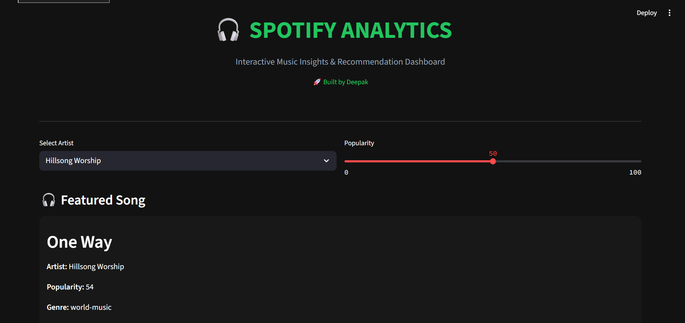
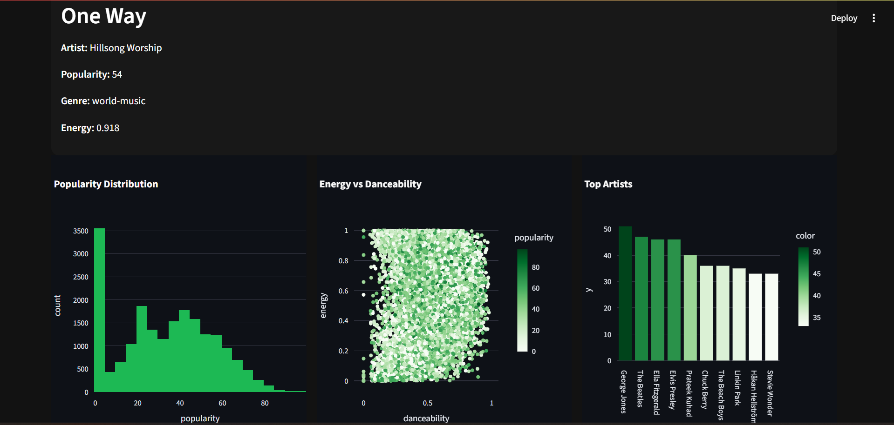
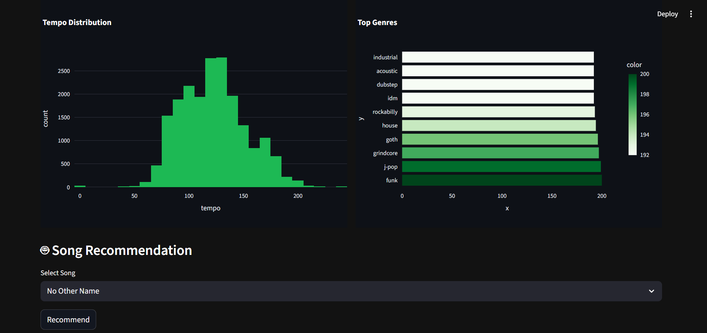

# 🎧 Spotify Analytics Dashboard


---

## 🚀 Overview

An **interactive data science dashboard** built using Streamlit to analyze Spotify music data and generate intelligent song recommendations.

---

## 📸 Dashboard Preview

### 🎯 Main Dashboard



### 🎧 Featured Song



### 📊 Insights & Charts



---

## ✨ Features

* 📊 **KPI Metrics Dashboard**
* 🎯 **Sidebar Filtering System**
* 📈 **Interactive Visualizations (Plotly)**
* 🤖 **Machine Learning Recommendation System**
* 🎧 **Clean Industry-Level UI**

---

## 🧠 Machine Learning

* Algorithm: **Cosine Similarity**
* Optimization: **On-demand similarity (memory efficient)**
* Features used:

  * Danceability
  * Energy
  * Tempo
  * Loudness

---

## 🛠️ Tech Stack

| Category      | Tools           |
| ------------- | --------------- |
| Language      | Python 🐍       |
| Data          | Pandas          |
| Visualization | Plotly 📊       |
| UI            | Streamlit 🌐    |
| ML            | Scikit-learn 🤖 |

---

## 📁 Project Structure

```
spotify-analytics-dashboard/
│
├── data/
│   └── spotify.csv
├── app.py
├── requirements.txt
├── dashboard1.png
├── dashboard2.png
├── dashboard3.png
└── README.md
```

---

## ▶️ Run Locally

```bash
pip install -r requirements.txt
streamlit run app.py
```

---

## 👨‍💻 Author

**Deepak** 🚀
AIML Student | Aspiring Software Developer

---

## ⭐ Support

If you like this project, give it a ⭐ on GitHub!
